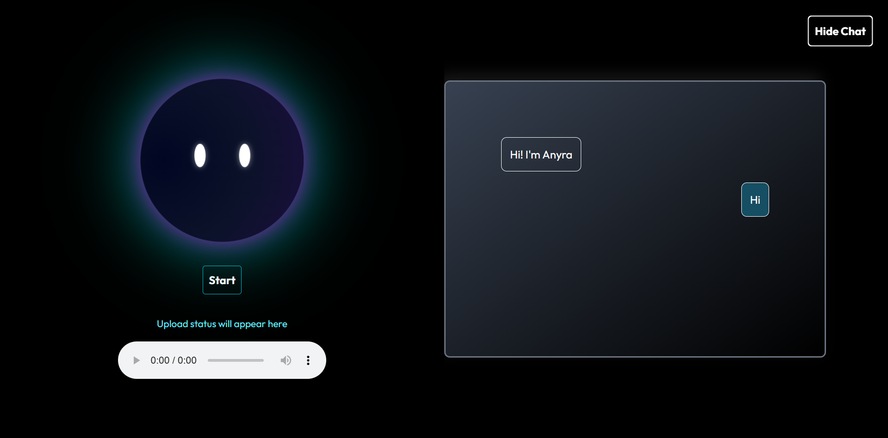

#  Anyra – AI Voice Assistant

Anyra is an **AI-powered conversational voice assistant** that combines **real-time speech recognition, large language models, and text-to-speech synthesis** to create natural, human-like voice conversations.  
It features **session-based memory**, an **animated avatar**, and an interactive chat UI to make AI interactions more engaging and lifelike.

---

##  Features
- Live Voice Capture – Supports **manual** & **automatic** recording modes.
- LLM Conversations – Context-aware responses using **Google Gemini**.
- Natural Voice Output – High-quality **Murf AI** text-to-speech.
- Fallback Voice – Browser SpeechSynthesis if TTS fails.
- Animated AI Avatar – Glowing orb & eye-tracking visuals.
- Dynamic Chat UI – Switch between avatar mode and side-by-side chat history.
- Persistent Context – Maintains session history using unique `session_id`.
- Audio Upload – Save manual recordings locally for future reference.
- Error Handling – Graceful fallback when APIs are unavailable.

---

## Tech Stack

| Layer            | Technology |
|------------------|------------|
| **Frontend**     | HTML, Tailwind CSS, JavaScript |
| **Backend**      | Python, FastAPI |
| **AI Model**     | Google Gemini 1.5 Flash |
| **Speech-to-Text** | AssemblyAI |
| **Text-to-Speech** | Murf API |
| **Styling**      | Tailwind CSS + custom animations |
| **Hosting**      | Local development (can be deployed on cloud) |

---

##  Architecture Overview

User speaks
↓
Audio capture in browser (MediaRecorder API)
↓
Send audio to FastAPI `/agent/chat/{session_id}`
↓
AssemblyAI transcribes speech → text
↓
Gemini LLM generates contextual reply
↓
Murf AI converts reply text → audio
↓
Browser plays audio + updates chat UI

## Installation & Setup

1️. Clone the Repository
git clone https://github.com/your-username/anyra-ai-voice-assistant.git
cd anyra-ai-voice-assistant

2️. Install Backend Dependencies
pip install -r requirements.txt

3️. Create a .env File
MURF_API_KEY=your_murf_api_key
ASSEMBLYAI_API_KEY=your_assemblyai_api_key
GEMINI_API_KEY=your_gemini_api_key

4️. Run the Backend Server
uvicorn app:app --reload

5. Backend will be available at:
http://127.0.0.1:8000

6. Serve the Frontend

You can open index.html directly via VS Code Live Server or:

python -m http.server 5500

7. Frontend will be available at:

http://127.0.0.1:5500/index.html

## Environment Variables

Variable	Description:

1.MURF_API_KEY	API key for Murf AI TTS
2.ASSEMBLYAI_API_KEY	API key for AssemblyAI STT
3.GEMINI_API_KEY	API key for Google Gemini LLM

## Usage

Start Backend – Run uvicorn app:app --reload

Open Frontend – Open index.html in your browser

Click Start – Begin recording voice

Speak Naturally – AI will transcribe, respond, and play audio

Switch Modes – Use “Show Chat” button to toggle chat view

Stop Recording – Click “Stop” when done

## Screenshots

## Future Enhancements

🌐 Multi-language support for STT & TTS

📱 Mobile-optimized UI

💾 Database-based conversation history

🔄 Continuous conversation without manual restarts

## Acknowledgments

Google Gemini – LLM responses

Murf AI – Text-to-Speech

AssemblyAI – Speech-to-Text

FastAPI – Backend framework

Tailwind CSS – UI styling