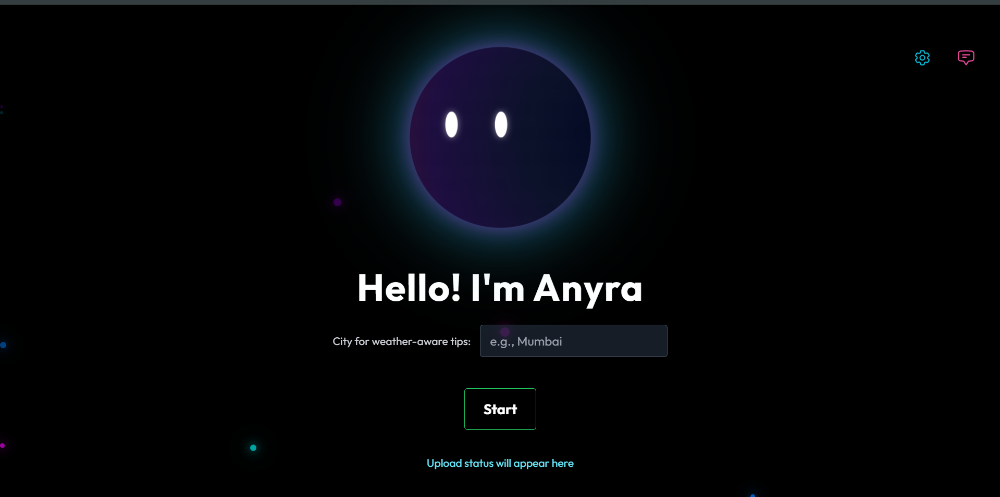
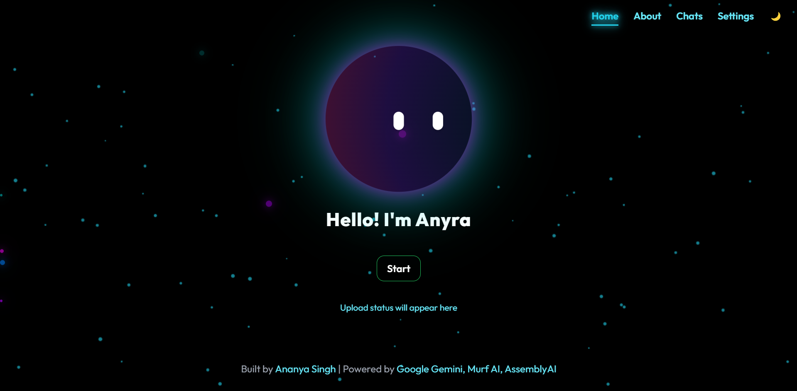

# 🎤 Anyra – AI Voice Assistant  

**Anyra** is an **AI-powered conversational voice assistant** that combines **real-time speech recognition**, **large language models**, and **text-to-speech synthesis** to create **natural, human-like voice conversations**.  

With a bold personality, an animated avatar, and interactive chat UI, Anyra delivers an **engaging, lifelike AI experience**.  

🌐 **Live Demo:** [Anyra on Render](https://anyra.onrender.com)  

---

## ✨ Features  

- 🎙️ **Live Voice Capture** – Manual & automatic recording modes.  
- 🧠 **LLM Conversations** – Context-aware replies powered by **Google Gemini 1.5 Flash**.  
- 🗣️ **Natural Voice Output** – **Murf AI TTS** with browser SpeechSynthesis fallback.  
- 👁️ **Animated Avatar** – Glowing orb + eye-tracking visuals for lifelike feel.  
- 💬 **Dynamic Chat UI** – Switch between **avatar mode** and **chat history**.  
- ♻️ **Persistent Context** – Maintains session memory with `session_id`.  
- 📂 **Audio Uploads** – Save manual recordings locally for later use.  
- 🚦 **Error Handling** – Graceful fallbacks if APIs fail.  
- 🔧 **Custom Personas** – Multiple personalities (futuristic, pirate, professor, etc.).  
- ⚡ **WebSocket Streaming** – Smooth **real-time speech-to-text** and **AI voice playback**.  

---

## 🪄 Skills  

Anyra is more than just small talk — she’s got **smart skills**:  

1. 🌦️ **Weather Report** – Get live weather updates by city.  
2. 😂 **Jokes** – Quick humor to lighten the mood.  
3. 🩺 **Health Recommendations** – Symptom-based general wellness tips (⚠️ not medical advice).  
4. 🌍 **Web Search** – Real-time factual queries answered via knowledge search.  
5. 📰 **News Headlines** – Latest updates and trending stories summarized.  

---

## 🛠️ Tech Stack  

| Layer        | Technology |
|--------------|------------|
| **Frontend** | HTML, Tailwind CSS, JavaScript |
| **Backend**  | Python, FastAPI |
| **AI Model** | Google Gemini 1.5 Flash |
| **STT**      | AssemblyAI |
| **TTS**      | Murf AI |
| **Styling**  | Tailwind CSS + custom animations |
| **Hosting**  | Render (deployed) |

---

## 🪄 Screenshots





## 🚀 Installation & Setup

1️⃣ Clone the Repository

git clone https://github.com/your-username/anyra-ai-voice-assistant.git
cd anyra-ai-voice-assistant


2️⃣ Install Backend Dependencies

pip install -r requirements.txt


3️⃣ Set Environment Variables (.env)

MURF_API_KEY=your_murf_api_key  
ASSEMBLYAI_API_KEY=your_assemblyai_api_key  
GEMINI_API_KEY=your_gemini_api_key  


4️⃣ Run the Backend Server

uvicorn app:app --reload


➡️ Backend: http://127.0.0.1:8000

5️⃣ Run the Frontend

python -m http.server 5500


➡️ Frontend: http://127.0.0.1:5500/index.html


## 🌱 Future Enhancements

🌐 Multi-language support for STT & TTS.

📱 Mobile-optimized responsive UI.

💾 Database-backed conversation history.

🔄 Continuous conversations without manual restarts.

🎭 Expanded personalities & voice styles.


## 🙏 Acknowledgments

Google Gemini – Contextual AI responses.

Murf AI – Text-to-Speech synthesis.

AssemblyAI – Speech-to-Text streaming.

FastAPI – Backend framework.

Tailwind CSS – Modern UI styling.

## ⚙️ Architecture  

```mermaid
flowchart TD
    A[🎙️ User Speaks] --> B[🎧 Audio Capture in Browser]
    B --> C[📡 FastAPI Backend /agent/chat/{session_id}]
    C --> D[📝 AssemblyAI Transcribes Speech → Text]
    D --> E[🤖 Gemini LLM Generates Contextual Reply]
    E --> F[🔊 Murf AI Converts Text → Speech]
    F --> G[🎧 Browser Plays Audio + Updates UI] 